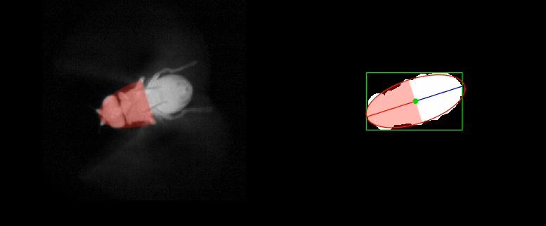

# Body tracker guide

The body tracker is mainly designed for videos of magnetically tethered flies. There is no reason to track the body of rigidly tethered animals unless it's to track the accuracy of the tracker itself.

## How it works

The [body_tracker.m](body_tracker.m) function will take in a video (either as a matrix or a path to a video file) and track the body yaw angle in all frames. First, each frame is pre-processed to get rid of noise and blurred to make the fly appear like one big blob (removes affects from legs, head, etc.). The body angle is then calculated by fitting an ellipse to the white pixels in each frame:

The initial heading of the fly is found using the [find_heading.m](../util/find_heading.m), which makes sure that we track the fly's head instead of the abdomen. 

## Running
The main function to register videos is [body_tracker.m](body_tracker.m):

    [angle, imgstats, initframe] = body_tracker(vid, save_path, mat_var_name, debug_heading, flip_vid, playback, vidpath)

### Input guide
* `vid` can be:
  * path to a video file (`.mp4` or `.avi`) 
  * path to a `.mat` file with a gray-scale video stored as a matrix in a MATLAB variable.
  * a MATLAB variable containing the video as a matrix

* `save_path`: sets the output path of the tracked_body data. This must be set if directly inputting a MATLAB variable for `vid`. Otherwise, this can be left empty `save_vid_path = []` and the default output path is `input-video-folder\tracked_body\input_video_name_tracked_body_data.mat`

 * `mat_var_name`: Only required if `vid` is a path to a `.mat` file. Sets the name of the video variable in the `.mat` file.

* `debug_heading`: sets how to determine the initial heading of the fly.

  * `debug_heading = 0` : automatically try to determine the fly heading, no user input required
  * `debug_heading = 1` : automatically try to determine the fly heading but ask user to check, user input always required
  * `debug_heading = 2` : automatically try to determine the fly heading but ask user to check only if the estimate is ambiguous.
  * With good quality videos, `debug_heading = 0` should be good enough. But if you are seeing the body tracker tracking the abdomen instead of the head try using `debug_heading = 2` or `debug_heading = 1`.

* `flip_vid`: boolean (true or false) variable that sets whether to flip each frame from left to right before tracking the body. This is useful if you are taking videos from below the animal, and you want to flip the apparent left-right body angle.

* `playback`: sets how to view the tracking progress. 
  * `0`: just show the tracking on the first frame to make sure heading was detected correctly
  * `1`: playback every frame while tracking
  * If `playback` is set to any other integer `n` then display every `n` frames

* `vidpath`: path to output the tracking video. If empty `vidpath = []`, then export to default directory. Set to `false` to skip export. Note that `playback` is ideally set to `1` if exporting a video, to get smooth looking videos.

### Output guide

[body_tracker.m](body_tracker.m) saves a `.mat` file containing:
   * `angle`: body angle in degrees
   * `imgstats`: stats from the ellipse fit such as the centroid, area, length, etc.
   * `initframe`: image of the first tracked frame. Useful for checking if the heading was found correctly.

Example output file: [example_body_free_tracked_body_data.mat](../example_videos/tracked_body/example_body_free_tracked_body_data.mat)

If `vidpath` is set, then the tracking video is also saved. Example tracking video:  Example tracking video:  [example_body_free_tracked_body.mp4](../example_videos/tracked_body/example_body_free_tracked_body.mp4)

### Example usage

#### From video file, debugging the initial heading, playing back every frame, & saving the tracking video in the default location
    vid = '..\example_videos\example_body_free.mp4';
    save_path = [];
    mat_var_name = [];
    debug_heading = 1;
    flip_vid = false;
    playback = 1;
    vidpath = [];

    [angle, imgstats, initframe] = body_tracker(vid, save_path, mat_var_name, debug_heading, flip_vid, playback, vidpath)