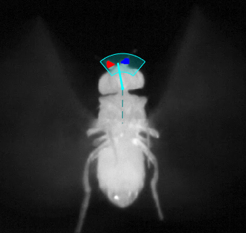

# Head tracker guide

The head tracker is designed for videos of rigidly tethered flies or videos that have been registered such that the body is fixed in place (see [registration_guide.md](../registration/registration_guide.md)).

## How it works

The [head_tracker.m](head_tracker.m) function will take in a video (either as a matrix or a path to a video file) and track the head yaw angle in all frames.

First, a GUI is used to allow the set a movable mask. The user should set the mask as illustrated below, where the middle point is aligned with the neck joint and the area within the two arcs sets the part of the image to consider when computing the head angle. The dashed axis represents the global angle (angle of fly body) to compute the head angle with respect to (CW +). Note that the mask can be set automatically (see inout guide below) if videos are similar to the example videos provided.

After clicking `Done`, the tracker will look for the points in the mask that are farthest from the neck joint. If the video quality is good and the fly's antennae are clearly visible, then this will result in two distinct clusters that are segmented out (red & blue points in image below), and a mean angle is computed for each cluster. The head angle is then computed as the mean of the two cluster's angles (cyan line in image).

## Running
The main function to register videos is [head_tracker.m](head_tracker.m)

    [data, mask] = head_tracker(vid, save_path, mat_var_name, mask_mode, npts, neck_frames, playback, vidpath);

### Input guide
* `vid` can be:
  * path to a video file (`.mp4` or `.avi`) 
  * path to a `.mat` file with a gray-scale video stored as a matrix in a MATLAB variable.
  * a MATLAB variable containing the video as a matrix

* `save_path`: sets the output path of the tracked_body data. This must be set if directly inputting a MATLAB variable for `vid`. Otherwise, this can be left empty `save_vid_path = []` and the default output path is `input-video-folder\tracked_body\input_video_name_tracked_body_data.mat`

 * `mat_var_name`: Only required if `vid` is a path to a `.mat` file. Sets the name of the video variable in the `.mat` file.

 * `mask_mode`: a `2 x 1` vector `[a, b]` where is `a` is a boolean that sets whether the mask it set automatically or just set to start at the middle of the frame and needs to be set by the user. Note that the auto-mask feature may not work if video quality deviates too much from the example videos provided. `b` is a boolean that sets whether the user gets the option to edit the mask. This should usually be set to `true` unless the automatically set mask is sufficient. `mask_mode` can also be passed as a previously saved mask structure. If analyzing a bunch of videos from one fly, it may be prudent to set the mask for the first video and then pass the previously saved mask to all subsequent videos.

* `npts`: the number of points to track in the head mask. This will depend on the resolution of your camera and how much of the frame your fly takes up. You typically want to set this such that you see most of the points on the antennae highlighted (red & blue points in image above) but not any points on the head itself.

* `neck_frames`: the number of frames in the video used to automatically find the neck joint when setting the mask. Only matters if `mask_mode(0) = true`.

* `playback`: sets how to view the tracking progress. 
  * `0`: just show the tracking on the first frame to make sure heading was detected correctly
  * `1`: playback every frame while tracking
  * If `playback` is set to any other integer `n` then display every `n` frames

* `vidpath`: path to output the tracking video. If empty `vidpath = []`, then export to default directory. Set to `false` to skip export. Note that `playback` is ideally set to `1` if exporting a video, to get smooth looking videos.

### Output guide

[head_tracker.m](head_tracker.m)  saves a `.mat` file containing:
   * `data`: structure with tracking data
     * `.angle`: head yaw angle **relative** to global frame
     * `.angle_glob`: head yaw angle **in** global frame
     * `.antenna`: yaw angle of each antenna in global frame
     * `.clust`: cluster labels for all tracked points
     * `.pts`: all tracked points
     * `.tip`: head tip, or the mean of both antennae positions

   * `mask`: copy of the head mask

Example output file: [example_body_free_registered_tracked_head_data.mat](../example_videos/tracked_head/example_body_fixed_tracked_head.mp4)

If `vidpath` is set, then the tracking video is also saved. Example tracking video: [example_body_free_tracked_body.mp4](../example_videos/tracked_body/example_body_free_tracked_body.mp4)

### Example usage

#### From video file, debugging the initial heading, playing back every frame, & saving the tracking video in the default location

    vid = 'example_videos\example_body_fixed.mp4'; % path to video file
    save_path = []; % path to new file (e.g., 'head_data.mat'). Leaving empty uses defualt path.
    mat_var_name = []; % only required if loading vidoe from a .mat file
    mask_mode = [1 1]; % set mask to auto, find the neck and let user adjust afterwards
    npts = 100; % about enough points to cover antennae
    neck_frames = 20; % use this many frames to find the neck
    playback = 1; % playback rate (1 = every frame)
    vidpath = []; % path to save tracking video. Leaving empty uses defualt path
    
    [data, mask] = head_tracker(vid, save_path, mat_var_name, mask_mode, npts, neck_frames, playback, vidpath);, neck_frames, playback, vidpath);