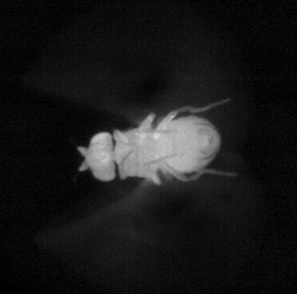
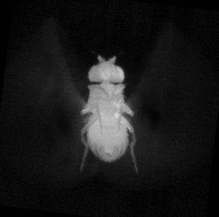

# Registration guide

When working with videos of magnetically tethered flies, or any kind of video where the animal body is moving, registration is a useful preprocessing step to allow other kinematics (such as head, abdomen, or wing movements) to be analyzed. There is no reason to register videos of rigidly tethered animals.

## How it works

The [register_video.m](register_video.m) function will take in a video (either as a matrix or a path to a video file) and perform a geometric transform using `imregtform.m` (https://www.mathworks.com/help/images/ref/imregtform.html) to rotate (and translate, if necessary) every frame in the video to most closely match the first frame in the video.

The [find_heading.m](../util/find_heading.m) function will then find the heading of the fly in the first frame, and rotate every registered frame such that the fly body is aligned as close as possible to the vertical axis (fly head pointing up).

The example video to register is [example_body_free.mp4](../example_videos/example_body_free.mp4), where the fly is rotating about the yaw axis and the frames look something like this:

  

After [register_video.m](register_video.m) has been applied, the new registered video will look like the body is not moving and the head is always oriented towards to top of the frame like this:

  

A registered video of [example_body_free.mp4](../example_videos/example_body_free.mp4) is provided [example_body_free_registered.mp4](../example_videos/registered/example_body_free_registered.mp4) to illustrate what a successful video registration should look like.

## Running
The main function to register videos is [register_video.m](register_video.m):

    [trf, body_angles_from_trf] = register_video(vid, save_vid_path, mat_var_name, debug_heading, flip_vid)

### Input guide

* `vid` can be:
  * path to a video file (`.mp4` or `.avi`) 
  * path to a `.mat` file with a gray-scale video stored as a matrix in a MATLAB variable.
  * a MATLAB variable containing the video as a matrix

* `save_vid_path`: sets the output path of the registered video. This must be set if directly inputting a MATLAB variable for `vid`. Otherwise, this can be left empty `save_vid_path = []` and the default output path is `input-video-folder\registered\input_video_name_registered.mp4`

 * `mat_var_name`: Only required if `vid` is a path to a `.mat` file. Sets the name of the video variable in the `.mat` file.

* `debug_heading`: sets how to determine the initial heading of the fly.

  * `debug_heading = 0` : automatically try to determine the fly heading, no user input required
  * `debug_heading = 1` : automatically try to determine the fly heading but ask user to check, user input always required
  * `debug_heading = 2` : automatically try to determine the fly heading but ask user to check only if the estimate is ambiguous. 

  * With good quality videos, `debug_heading = 0` should be good enough. But if your registered videos are flipped upside down (fly head pointing towards bottom of the frame) then you may want to try `debug_heading = 2` or `debug_heading = 1`.

* `flip_vid`: boolean (true or false) variable that sets whether to flip each frame from left to right in the registered video. This is useful if you are taking videos from below the animal, and you want to flip the apparent left-right wings, legs, etc.

### Output guide

[register_video.m](register_video.m) saves two files
1. `.mp4` of the registered video
2. `.mat` file containing the registration transformation data & the body angle pulled from this transform
   * `trf`: 2D affine transformation for each frame
   * `body_angles_from_trf`: body angles calculated from registration transformations in `trf`

Example registered video file: [example_body_free_registered.mp4](../example_videos/registered/example_body_free_registered.mp4)

Example `.mat` file: [example_body_free_registered_data.mat](../example_videos/registered/example_body_free_registered_data.mat)

### Example usage

#### From video file
    vid = '..\example_videos\example_body_free.mp4';
    save_vid_path = [];

    [trf, body_angles_from_trf] = register_video(vid, save_vid_path);

#### From video file with extra inputs
    vid = '..\example_videos\example_body_free.mp4';
    save_vid_path = [];
    mat_var_name = [];
    debug_heading = 1;
    flip_vid = true;

    [trf, body_angles_from_trf] = register_video(vid, save_vid_path, mat_var_name, debug_heading, flip_vid);

#### From .mat file
    vid = '..\example_videos\example_body_free.mat';
    save_vid_path = [];
    mat_var_name = 'vid';

    [trf, body_angles_from_trf] = register_video(vid, save_vid_path, mat_var_name);

#### From matrix in MATLAB variable
    load('..\example_videos\example_body_free.mat');
    save_vid_path = '..\example_videos\registered\example_body_free_registered.mp4';

    [trf, body_angles_from_trf] = register_video(vid, save_vid_path);

## Notes
* If your videos are stored in `.mat` files and are too big to load into ram, convert them to `.mp4` files first. [mat2vid.m](../util/mat2vid.m) is a useful function for this purpose.